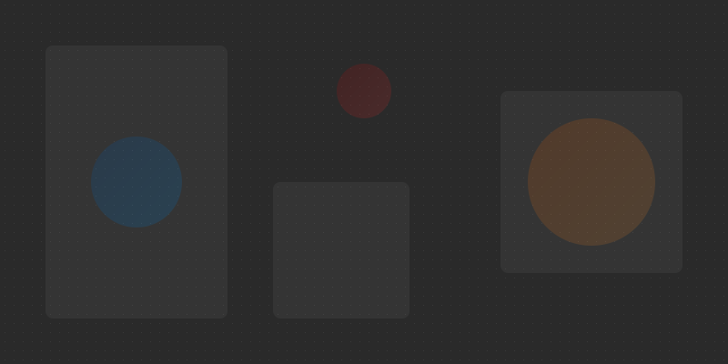

# Pixels on Paper

A modern, responsive e-commerce website for a print shop specializing in document printing, photo printing, xerox services, and online application assistance. This project is designed to be easily customizable with a clean, professional design.



## 📋 Project Overview

**Pixels on Paper** is a static website for a print shop with the tagline *"Where digital dreams hit the page."* The site features a modern design with gradient effects, responsive layout, and language translation support.

### 🎨 Brand Identity

- **Color Palette:**
  - Primary: `#0066CC` (Blue)
  - Secondary: `#FF6600` (Orange)
  - Accent: `#CC0000` (Red)
  - Background: `#F9FAFC` (Off White)

## 📱 Features

- **Responsive Design:** Works perfectly on all devices (mobile, tablet, desktop)
- **Modern UI:** Clean interface with gradient effects and smooth animations
- **Language Support:** One-click translation to Bangla
- **Optimized Performance:** Fast loading times with optimized SVG images

## 📄 Pages

- **Homepage (`index.html`):** Features a hero banner, services overview, and workflow section
- **Product Pages:**
  - Document Prints (`products/document-prints.html`)
  - Photo Prints (`products/photo-prints.html`)
  - Xerox Services (`products/xerox-services.html`)
  - Online Application (`products/online-application.html`)
- **Order Page (`order.html`):** Information about ordering and delivery
- **Terms & Contact (`contract.html`):** Contains terms of service and contact information
- **Preview Page (`preview.html`):** Quick access to all website pages

## 🛠️ Customization Guide

### 🖼️ Changing Images

All images are SVG files located in the `images/` directory:

- `hero-bg.svg` - Homepage hero background
- `document-print-preview.svg` - Document printing preview image
- `document-print-services.svg` - Document printing services image
- `photo-print-detail.svg` - Photo printing detail image
- `xerox-services-detail.svg` - Xerox services detail image
- `online-application-detail.svg` - Online application services image

To replace an image:
1. Create a new SVG with the same dimensions
2. Save it with the same filename in the `images/` directory

### 🎭 Changing Colors

All colors are defined as CSS variables in `css/styles.css` (lines 20-60):

```css
:root {
    /* Brand Colors */
    --primary-color: #0066CC;
    --secondary-color: #FF6600;
    --accent-color: #CC0000;
    
    /* Background Colors */
    --background-primary: #F9FAFC;
    --background-secondary: #E6E9F0;
    --background-light: #FFFFFF;
    --background-dark: #2A2A2A;
    /* ... more variables ... */
}
```

To change the color scheme, simply update these variables.

### 📝 Changing Content

#### Company Information

1. **Company Name:** Update the logo text in each HTML file's header section:
   ```html
   <div class="logo">
       <h1>Pixels on Paper</h1>
   </div>
   ```

2. **Page Titles:** Update the `<title>` tag in each HTML file's head section:
   ```html
   <title>Pixels on Paper | Document Print Shop</title>
   ```

3. **Meta Descriptions:** Update the description meta tag in each HTML file:
   ```html
   <meta name="description" content="Pixels on Paper - Where digital dreams hit the page. Document printing, photo printing, and xerox services.">
   ```

#### Product Information

1. **Prices:** Update the price tables in each product page:
   ```html
   <table class="price-table">
       <!-- Update prices here -->
   </table>
   ```

2. **Service Descriptions:** Update the text content in each product page's sections.

### 🔤 Changing Language Translation

The translation functionality is handled by `js/translate.js`. To modify the Bangla translations:

1. Open `js/translate.js`
2. Find the translation object
3. Update the Bangla translations for each key

## 📁 Project Structure

```
pixels-on-paper/
├── index.html              # Homepage
├── order.html              # Order and delivery information
├── contract.html           # Terms of service and contact page
├── preview.html            # Website preview page
├── css/
│   └── styles.css          # Main stylesheet
├── images/                 # SVG image assets
│   ├── hero-bg.svg
│   ├── document-print-preview.svg
│   ├── document-print-services.svg
│   ├── photo-print-detail.svg
│   ├── xerox-services-detail.svg
│   └── online-application-detail.svg
├── js/                     # JavaScript files
│   ├── mobile-menu.js      # Mobile navigation functionality
│   └── translate.js        # Language translation functionality
├── products/               # Product pages
│   ├── document-prints.html
│   ├── photo-prints.html
│   ├── xerox-services.html
│   └── online-application.html
└── README.md               # Project documentation
```

## 🚀 Setup Instructions

### Local Development

1. Clone this repository to your local machine
2. Navigate to the project directory
3. Open `index.html` in your web browser

Alternatively, you can use a local development server:

```bash
npx http-server -p 8080
```

### Deployment

This is a static website that can be deployed to any web hosting service:

1. Upload all files to your web hosting service
2. Ensure the directory structure is maintained
3. No server-side configuration is required

## 📱 Browser Compatibility

- Chrome (latest)
- Firefox (latest)
- Safari (latest)
- Edge (latest)
- Mobile browsers (iOS Safari, Android Chrome)

---

© 2023 Pixels on Paper. All rights reserved.
